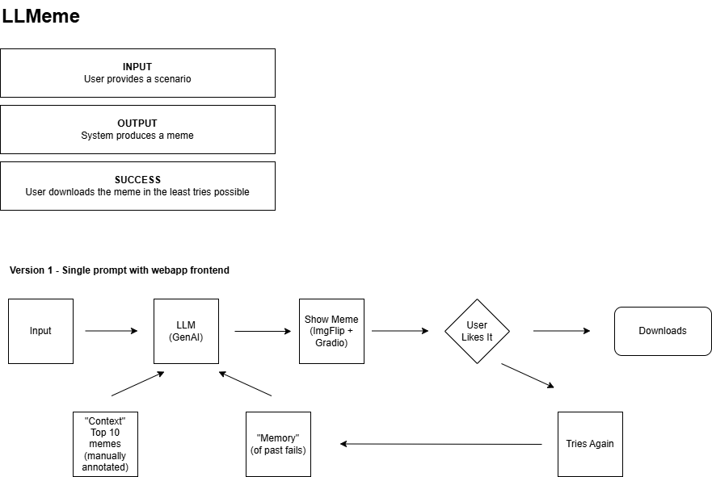

# LLMeme

## Description

LLMeme is a tool that suggests memes to users based on ideas and text descriptions. It was was made as a homework submission to the LLM SDLC course carried out in Jan 2025 - [link](https://maven.com/hugo-stefan/building-llm-apps-ds-and-swe-from-first-principles)

## Contributions

You're welcome to contribute to this project through opening an issue or a pull request.

## Acknowledgements

- Hugo Bowne-Anderson and Stefan Krawczyk for the instruction and much of the template code.
- [meme-cap](https://github.com/eujhwang/meme-cap/tree/main) - a dataset of LLM captioned memes from r/meme - authored by `EunJeong Hwang and Vered Shwartz`.

## License

This project is licensed under the MIT License. See the [LICENSE](LICENSE) file for details.

## Journal

### Initial Scope
- [X] Prototype prompts using a variety of LLMs and an open dataset of memes - WIP
- [X] Deploy a gradio demo using a cloud service called modal
- [ ] Evaluate the performance of the prompts using a test database, human annotation, stretch LLM as a judge
- [ ] Create tests for the prompts (using pytest)
- [ ] Incorporate CI/CD using github actions
- [ ] Experiment with semantic search and if need be vector databases
- [ ] Create an agentic system that can generate memes in discord

### First Sprint
All that got too complicated and in the way of user feedback - so simplified to the following simple call and app in GradIO:

### Second Sprint
Some evals should have been done prior to pushing it live - so this was the focus, and identified:
- poor JSON formatting
- problems with the JSON validation limiting the meme search space (to only those with two text boxes - e.g. Drake)

Pushed an improved version to modal - though some prompts like `Toddler is not impresssed with his dad's cooking` still fail.

User now sees an error message when the prompt fails.

### Third Sprint
The focus of this sprint was
- Evaluation and tests
    - Identified a need for imroved logs (including test vs prod traffic)
    - Tested for base template coverage (some templates are picked more often than others)
    - Annotating hallucination, incomplete, relevant, surprising, clever, like it, for a baseline 
        - need to make it easier on the annotater
        - baseline 11/28 memes "liked"

It would be great to try this again with a different LLM - i.e. gemini 2 or grok 3